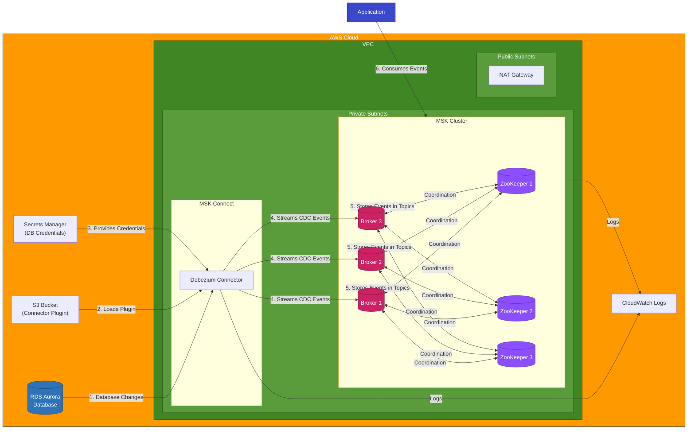

# AWS MSK with Debezium Data Flow Diagram

## Data Flow Explanation

### 1. Database Changes Capture
- Changes in the RDS Aurora database (inserts, updates, deletes) are captured by the Debezium connector using the database's binary log.

### 2. Connector Plugin Loading
- The Debezium MySQL connector plugin is loaded from an S3 bucket into the MSK Connect service.

### 3. Secure Credential Management
- Database credentials are securely retrieved from AWS Secrets Manager by the connector.

### 4. Change Data Streaming
- Debezium formats the captured changes as events and streams them to the MSK cluster's Kafka brokers.

### 5. Topic Storage
- The Kafka brokers store these events in topics, organized by database tables.
- Each topic contains a sequence of change events for a specific table.

### 6. Application Consumption
- Applications can consume these change events from the Kafka topics in real-time.
- This enables event-driven architectures, data replication, and real-time analytics.

### Additional Flows
- **Logging**: Both MSK and the Debezium connector log to CloudWatch for monitoring and troubleshooting.
- **Coordination**: ZooKeeper nodes manage the Kafka cluster state, leader election, and configuration.

This architecture provides a robust, scalable solution for Change Data Capture (CDC) that can handle high throughput and maintain data consistency between systems. 