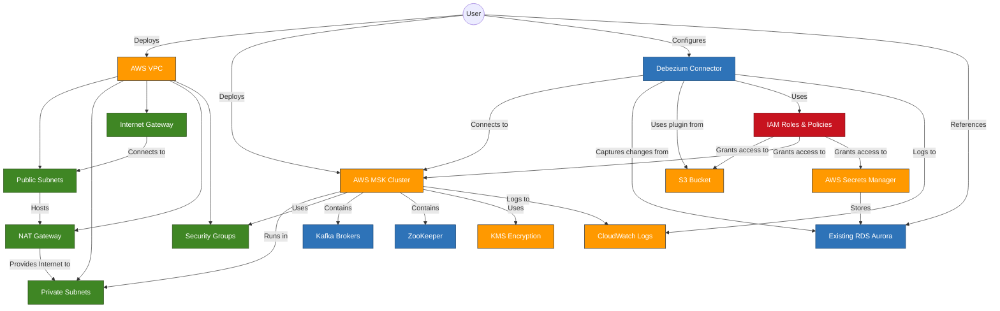

# AWS MSK with Debezium Connector Infrastructure Diagram

## Infrastructure Components Explanation

### VPC and Networking
- **VPC**: Contains all the infrastructure components
- **Public Subnets**: Host the NAT Gateway and provide external access
- **Private Subnets**: Host the MSK cluster and other private resources
- **Internet Gateway**: Provides internet access to public subnets
- **NAT Gateway**: Allows private subnet resources to access the internet
- **Security Groups**: Control traffic between resources

### MSK Cluster
- **Kafka Brokers**: The core of the MSK cluster, running Apache Kafka
- **ZooKeeper**: Manages the Kafka cluster state
- **KMS Encryption**: Provides encryption at rest for the MSK cluster
- **CloudWatch Logs**: Stores logs from the MSK cluster

### Debezium Connector
- **Connector**: Captures change data from the RDS Aurora database
- **S3 Bucket**: Stores the Debezium connector plugin
- **IAM Roles & Policies**: Provide necessary permissions
- **Secrets Manager**: Securely stores database credentials

### External Resources
- **RDS Aurora**: The existing database from which changes are captured

This architecture enables Change Data Capture (CDC) from your RDS Aurora database to Kafka topics in the MSK cluster, allowing real-time data streaming and event-driven architectures. 