# Terraform Resources Relationship Diagram

```mermaid
graph TD
    %% Main Modules
    main[main.tf]
    vpc_mod[VPC Module]
    msk_mod[MSK Module]
    debezium_mod[Debezium Module]
    
    %% VPC Resources
    vpc[aws_vpc.main]
    priv_subnet[aws_subnet.private]
    pub_subnet[aws_subnet.public]
    igw[aws_internet_gateway.main]
    nat_eip[aws_eip.nat]
    nat_gw[aws_nat_gateway.main]
    pub_rt[aws_route_table.public]
    priv_rt[aws_route_table.private]
    pub_rta[aws_route_table_association.public]
    priv_rta[aws_route_table_association.private]
    sg[aws_security_group.default]
    
    %% MSK Resources
    msk_sg[aws_security_group.msk]
    kms[aws_kms_key.msk]
    cw_log[aws_cloudwatch_log_group.msk]
    msk_config[aws_msk_configuration.msk]
    msk_cluster[aws_msk_cluster.msk]
    s3_bucket[aws_s3_bucket.debezium_plugin]
    s3_object[aws_s3_object.debezium_plugin]
    msk_plugin[aws_mskconnect_custom_plugin.debezium]
    msk_role[aws_iam_role.msk_connect]
    msk_policy[aws_iam_policy.msk_connect]
    msk_attach[aws_iam_role_policy_attachment.msk_connect]
    
    %% Debezium Resources
    secret[aws_secretsmanager_secret.db_credentials]
    secret_ver[aws_secretsmanager_secret_version.db_credentials]
    secret_policy[aws_iam_policy.secrets_access]
    connector[aws_mskconnect_connector.debezium]
    conn_log[aws_cloudwatch_log_group.connector_logs]
    
    %% Module Relationships
    main -->|references| vpc_mod
    main -->|references| msk_mod
    main -->|references| debezium_mod
    vpc_mod -->|outputs to| msk_mod
    msk_mod -->|outputs to| debezium_mod
    
    %% VPC Resource Relationships
    vpc_mod -->|creates| vpc
    vpc_mod -->|creates| priv_subnet
    vpc_mod -->|creates| pub_subnet
    vpc_mod -->|creates| igw
    vpc_mod -->|creates| nat_eip
    vpc_mod -->|creates| nat_gw
    vpc_mod -->|creates| pub_rt
    vpc_mod -->|creates| priv_rt
    vpc_mod -->|creates| pub_rta
    vpc_mod -->|creates| priv_rta
    vpc_mod -->|creates| sg
    
    vpc -->|referenced by| priv_subnet & pub_subnet
    vpc -->|referenced by| igw
    vpc -->|referenced by| pub_rt & priv_rt
    vpc -->|referenced by| sg
    
    igw -->|referenced by| pub_rt
    nat_eip -->|referenced by| nat_gw
    pub_subnet -->|referenced by| nat_gw
    nat_gw -->|referenced by| priv_rt
    
    pub_rt -->|referenced by| pub_rta
    priv_rt -->|referenced by| priv_rta
    pub_subnet -->|referenced by| pub_rta
    priv_subnet -->|referenced by| priv_rta
    
    %% MSK Resource Relationships
    msk_mod -->|creates| msk_sg
    msk_mod -->|creates| kms
    msk_mod -->|creates| cw_log
    msk_mod -->|creates| msk_config
    msk_mod -->|creates| msk_cluster
    msk_mod -->|creates| s3_bucket
    msk_mod -->|creates| s3_object
    msk_mod -->|creates| msk_plugin
    msk_mod -->|creates| msk_role
    msk_mod -->|creates| msk_policy
    msk_mod -->|creates| msk_attach
    
    msk_sg -->|referenced by| msk_cluster
    kms -->|referenced by| msk_cluster
    cw_log -->|referenced by| msk_cluster
    msk_config -->|referenced by| msk_cluster
    
    s3_bucket -->|referenced by| s3_object
    s3_bucket -->|referenced by| msk_policy
    s3_object -->|referenced by| msk_plugin
    
    msk_role -->|referenced by| msk_attach
    msk_policy -->|referenced by| msk_attach
    
    %% Debezium Resource Relationships
    debezium_mod -->|creates| secret
    debezium_mod -->|creates| secret_ver
    debezium_mod -->|creates| secret_policy
    debezium_mod -->|creates| connector
    debezium_mod -->|creates| conn_log
    
    secret -->|referenced by| secret_ver
    secret -->|referenced by| secret_policy
    conn_log -->|referenced by| connector
    
    %% Cross-Module Relationships
    priv_subnet -->|referenced by| msk_cluster
    sg -->|referenced by| msk_cluster
    
    msk_cluster -->|referenced by| connector
    msk_plugin -->|referenced by| connector
    msk_role -->|referenced by| connector
    
    %% Styling
    classDef module fill:#6610f2,stroke:#4B0BA8,color:white
    classDef vpc fill:#3F8624,stroke:#294D16,color:white
    classDef msk fill:#FF9900,stroke:#B86E00,color:white
    classDef debezium fill:#E83E8C,stroke:#A22A64,color:white
    classDef main fill:#007BFF,stroke:#0056B3,color:white
    
    class main main
    class vpc_mod module
    class msk_mod module
    class debezium_mod module
    
    class vpc,priv_subnet,pub_subnet,igw,nat_eip,nat_gw,pub_rt,priv_rt,pub_rta,priv_rta,sg vpc
    class msk_sg,kms,cw_log,msk_config,msk_cluster,s3_bucket,s3_object,msk_plugin,msk_role,msk_policy,msk_attach msk
    class secret,secret_ver,secret_policy,connector,conn_log debezium
```

## Terraform Resources Explanation

This diagram illustrates how the Terraform resources are organized and related to each other in the infrastructure:

### Module Structure
- **Main Module**: The entry point that references all other modules
- **VPC Module**: Creates the networking infrastructure
- **MSK Module**: Sets up the Kafka cluster and related resources
- **Debezium Module**: Configures the CDC connector

### Resource Dependencies
1. **VPC Resources**: The foundation of the infrastructure
   - VPC, subnets, gateways, and routing tables establish the network
   - Security groups control traffic between resources

2. **MSK Resources**: Built on top of the VPC
   - MSK cluster runs in private subnets
   - Uses security groups from the VPC module
   - Creates its own security group for Kafka-specific traffic
   - Sets up encryption, logging, and configuration

3. **Debezium Resources**: Connects MSK to RDS
   - Creates a connector that references the MSK cluster
   - Uses the custom plugin from the MSK module
   - Sets up secure credential storage
   - Configures logging for monitoring

### Cross-Module Dependencies
- The VPC module outputs subnet and security group IDs used by the MSK module
- The MSK module outputs cluster ARN, bootstrap brokers, and other details used by the Debezium module
- The Debezium module references the existing RDS Aurora database

This modular approach allows for:
- Clear separation of concerns
- Reusable components
- Easier maintenance and updates
- Scalable infrastructure design 